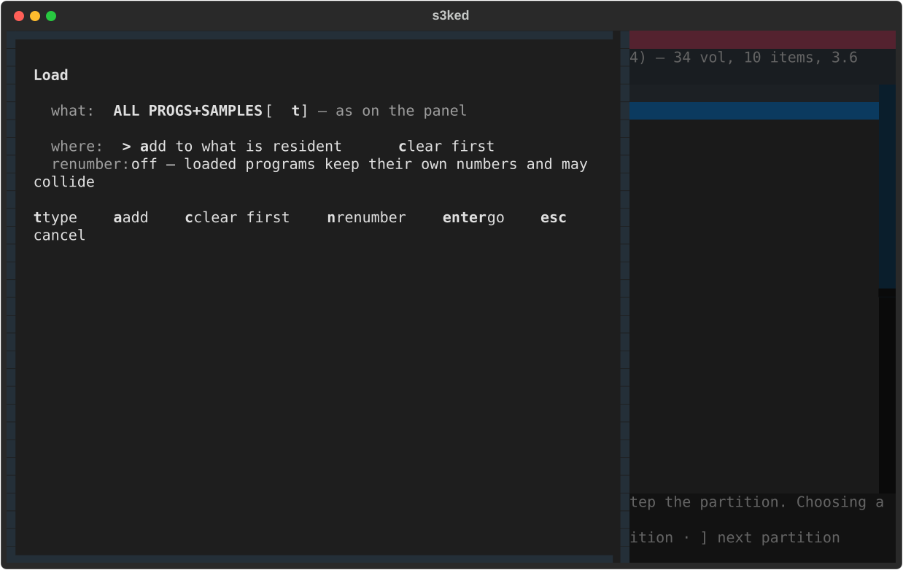
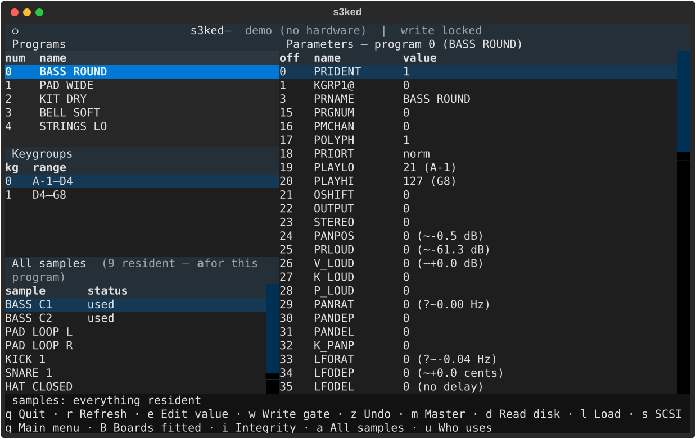
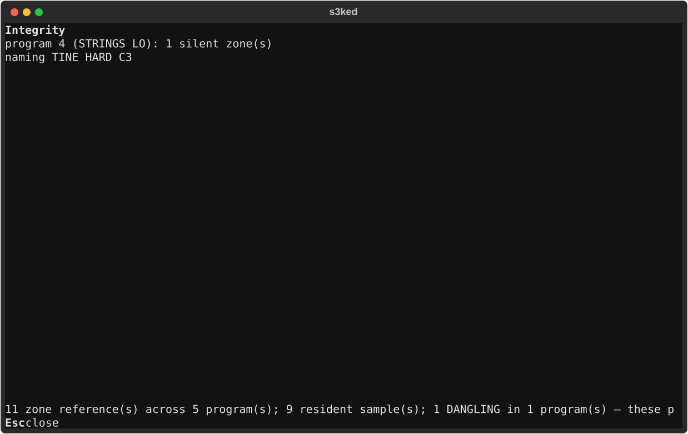

<!--
SPDX-License-Identifier: GPL-2.0-or-later
SPDX-FileCopyrightText: Copyright (C) 2026  s3ked contributors
-->

# s3ked

A terminal editor for the **Akai S1000/S3000 sampler family** — S2000,
S2800, S3000, S3000XL, S3200, S3200XL — over MIDI System Exclusive.

Browse programs, keygroups and samples; read and edit any documented header
parameter; all from a Textual TUI or a small CLI.

## ⚠️ Use at your own risk — back up first, hardware verification is extensive but partial

s3ked is provided **as is, with absolutely no warranty and no liability** for
data loss or **hardware damage**. You assume all risk. Full terms:
[DISCLAIMER.md](DISCLAIMER.md).

**This has been driven hard against a real S3000XL.** The read paths, the
write path, the physical-unit laws and the whole disk workflow have been
exercised on hardware, along with the program and sample deletes. Deleting a
single **keygroup** (`DELK`) has never been fired at a real machine and is
listed as unverified rather than quietly included here. `docs/RESOLUTION_NOTES.md` records
each measurement — including the ones that
turned out to be wrong and were retracted. Live use is what found most of the
interesting bugs; no amount of reading the specification would have surfaced
them.

**What that verification cost, stated plainly, because it is the honest
warning:** this project has crashed an S3000XL twice by writing a register out
of range, and wedged it twice more by killing its own client mid-exchange. All
four needed a power cycle. Nothing was lost — the machine's RAM is volatile
and nothing was written to disc — but a sampler that stops answering until you
reach behind it is exactly the failure mode to expect while pointing this at
something you care about.

The parameter byte offsets come from a third-party hand transcription of an
Akai document. Most are now confirmed, and the ones that are not are listed in
[TODO.md](TODO.md) rather than implied to be safe. A wrong offset writing to
the wrong parameter remains a realistic failure mode.

The write gate is **off by default** for those reasons. Back up anything you
care about, and read [DISCLAIMER.md](DISCLAIMER.md).

## AI assistance & human authorship

s3ked was built by its human author, **Jan Lentfer**, together with
Anthropic's **Claude**. The **ideas, the project vision, and every feature**
came from the human author; Claude assisted with **writing the code** and the
docs. Crucially, the **reverse engineering rests on hands-on human work** —
every protocol behaviour this depends on was established against a real
S3000XL, and the readings that only a person at the front panel can make are
the ones the whole disk workflow turned on: the load-type list, the volume
register, the directory cursor, and the LCD confirming that a write had moved
the machine rather than merely being stored. Full account in
[DISCLAIMER.md](DISCLAIMER.md).

---

## Is this the screen mirror you were looking for?

No — and that is settled rather than unexplored. The sibling
[k2kremote](https://github.com/lentferj/k2kremote) project mirrors a Kurzweil
K2000's LCD in a terminal and injects front-panel presses. **The Akai
S1000/S3000 family has no protocol for that**: no display read, no button
injection, no panel echo, verified against the Akai documentation itself.
See [`docs/RESOLUTION_NOTES.md` §1](docs/RESOLUTION_NOTES.md) for the survey
and its sources.

What the family *does* have is a capable editor/librarian protocol, and that
is what s3ked implements. (Akai did ship a k2kremote-style panel protocol one
generation later, on the Z4/Z8/S5000/S6000/MPC4000 — but its screen read is a
USB bulk transfer, not SysEx, so it needs a port this family lacks. §1 has the
details.)

## Install

```sh
git clone https://github.com/lentferj/s3ked
cd s3ked
python3 -m venv .venv
.venv/bin/pip install -e '.[dev]'      # quote it — zsh globs brackets
```

Requires Python 3.11+ and two packages: `textual` and `python-rtmidi`. Both
come from PyPI as wheels, so nothing needs compiling and no system packages
are required — tested from a clean checkout into an empty venv.

**No numpy.** The editor does no arithmetic that needs it. The bench tooling
in `probes/` does — FFTs and curve fits, for calibrating parameters against
real audio — and that is not part of the distribution. `pip install -e
'.[dev,bench]'` adds it if you want to run the calibration tests too; without
it those two modules skip and the rest of the suite runs.

Add `--system-site-packages` to the `venv` line only if you would rather reuse
a system `python-rtmidi` you already have.

## What it looks like


The write gate is closed until you open it, and the header says which state it
is in:


Editing one parameter shows its range and the specification's own wording for
it, so a value can be checked against the document without leaving the screen:


### The disk, driven entirely from the terminal

This is the part worth having. **The whole of the sampler's LOAD page is
reachable over MIDI** — SCSI drive, device, partition, volume, what to load
and the load itself — so a disc can be browsed and pulled into memory without
touching the machine.


`d` or `l` opens the browser in the right-hand pane, showing the volumes on
the current partition and, below a divider, the contents of the selected one.
`[` and `]` step the partition; `Enter` on a volume selects it.

`l` from inside the browser offers the load, and there is more to choose than
there sounds:




| | |
|---|---|
| **all eight load types** | `ENTIRE VOLUME`, `ALL PROGS+SAMPLES`, `programs only`, `all samples`, the two cursor variants, `Multi+progs+Samps` — `t` cycles them |
| **one item at a time** | put the cursor on a program or sample row and the load aims at exactly that, by writing the machine's own directory highlight |
| **onto what is there, or onto an emptied machine** | loads append, so building a bank from several volumes needs the *sum* to fit |
| **renumber afterwards** | because loads append and each volume's programs keep the numbers they were saved with |

The load confirms first and says whether it **fits in free memory** — the one
thing the sampler will not tell you until it has already half-loaded and
stopped with "insufficient waveform memory", leaving programs whose samples
never arrived playing silence.

Everything here writes to the machine, so all of it needs the write gate.

> **Why the renumbering matters.** `PRGNUM` — the MIDI program number — is
> stored *inside* each program and reloaded verbatim, and volumes authored
> independently all start at 1. Load four of them and four programs claim
> number 1; they do not overwrite each other, they **stack**, so one program
> change fires all four at once. The panel's `RNUM` → `SEQU` fixes it and so
> does this, in one keystroke.

The volume list is 7 round trips for a 100-volume disk, about 1.3 seconds,
which is why it happens on `d` rather than at startup.

`Operating System` is the one load type the TUI will not offer: it loads an OS
off the disc over the running one, and the bridge refuses it without an
explicit flag.

The samples pane shows what the selected program references; `a` swaps it for
everything the machine holds, which is the view the integrity work is done
from:



Deleting anything lives behind a separate screen that has to be armed and then
fired, because the protocol offers no device-side confirmation and no undo:


### Expansion boards must be declared

Fifteen keygroup fields belong to the optional **IB304F** filter board — the
second filter, the tone section, and all eight stages of envelope 3 — and the
effects pages belong to the **EB16**. On a machine without them these are not
merely inert: the panel refuses to open the pages at all, and this project
crashed an S3000XL twice in one session while that area was being exercised
(`docs/RESOLUTION_NOTES.md` §85, §90).

So s3ked refuses to read or write them unless you say the board is there:

```toml
# config.toml
ib304f_fitted = true
eb16_fitted   = false
```

or press `B` in the TUI. **The machine cannot be asked** — no reply carries a
fitted-options field, and the mode register will happily open a page the
panel refuses — so this is a declaration, and the default assumes nothing is
fitted.

### What plays silence

A load that overruns memory says "insufficient waveform memory" **once** and
then behaves normally. The programs stay resident and selectable; the ones
whose samples never arrived play nothing, and the machine will not tell you
which. `i` walks every keygroup and says:



`u` answers the other direction — every zone that uses the selected sample.
Both are read-only, so neither needs the write gate. From the shell:

```console
$ s3kcli audit
DANGLING -- these zones name a sample the machine does not hold, and play silence:

prog  program      kg  zone  names
4     STRINGS LO   2   1     TINE HARD C3

11 zone reference(s) across 5 program(s); 9 resident sample(s); 1 DANGLING in 1 program(s) — these play silence; 3 unused sample(s)

$ s3kcli audit --sample "BASS C2"
prog  program      kg  zone
0     BASS ROUND   1   1
1     BASS SUB     0   1

2 zone(s) use 'BASS C2'
```

Zones reference samples by **name**, not by number, so renaming a sample
breaks every zone that named it — and because the machine enforces no name
uniqueness, two samples sharing a name make a reference that cannot be
resolved to either. The audit reports that rather than picking one.

These are generated from `--demo` by `tools/screenshots.py`, which checks each
image contains what its caption claims before it is written.

## Try it without hardware

Every command takes `--demo`, which runs against an in-memory sampler and
opens no MIDI ports at all:

```sh
.venv/bin/s3kcli --demo status
.venv/bin/s3kcli --demo programs
.venv/bin/s3kcli --demo header program 0
.venv/bin/s3ked  --demo                  # the TUI
```

## Using it

```sh
s3kcli ports                             # what MIDI ports exist here
s3kcli status                            # autodetect, then RSTAT
s3kcli programs                          # resident program names
s3kcli header keygroup 2 --keygroup 0    # a whole header, decoded
s3kcli header multipart 3                # multi mode (S2000/S3000XL/S3200XL)
s3kcli get PRIORT 0                      # one parameter
s3kcli --allow-write set PRIORT 3 0      # write one parameter
s3kcli params --search LFO               # browse the table, no device needed
```

### Values in units you can read

The specification gives every parameter a range and none of its meaning:
`FILFRQ` is "basic filter frequency, 0 to 99" and not one word about which
hertz. Those laws were measured on hardware, so s3ked shows both:

```sh
$ s3kcli get TEMPER 0
TEMPER = equal temperament  (raw (0, 0, 0, 0, 0, 0, 0, 0, 0, 0, 0, 0))

$ s3kcli get FILFRQ 0
FILFRQ = 0 (?~6.46 Hz)  (raw 0)
```

and takes a quantity where a raw number would go:

```sh
$ s3kcli --allow-write set FILFRQ 500Hz 0
FILFRQ = 61 (~491 Hz)

$ s3kcli --allow-write set ATTAK1 250ms 0
ATTAK1 = 66 (~258 ms)
```

The parameter is an integer, so 500 Hz lands on the value that gives 491 --
and the read-back says so rather than echoing what was asked for.

35 laws are measured, in hertz, seconds, decibels, cents, dB/s and a few
dimensionless ratios. **A rendering carries its own doubt.** The `?` above is
not noise: `FILFRQ` 0 is below the range the law was measured over, so the
6.46 Hz is an extrapolation and says so. A law whose meaning is not yet
settled renders with `!` instead. Neither mark is decoration -- a fit is not a
specification, and the machine is free to do something else where nobody
looked.

Where a value is an enumeration from the document rather than a measurement,
the name wins over the fit. `TEMPER` is twelve independent detunes, one per
semitone, and reads as notes rather than as twelve numbers.

**Autodetect has to sweep**, because this protocol has no broadcast address:
a device answers only on its own exclusive channel, and the only message that
reports that channel can only be sent to the right channel. s3ked probes
channel 0 (the factory value) on every port; if your machine is elsewhere,
pass `--exclusive-channel N`. The port pair that answers is remembered in
`config.toml`.

### TUI keys

| key | action |
|---|---|
| `e`, `Enter` | edit the selected parameter |
| `w` | toggle the write gate (shown in the header when armed) |
| `z` | undo the last write |
| `Z` | undo everything written this session |
| `h` | change history — every write, with where it went |
| `r` | re-read the catalog |
| `d` | read the disk and show the browser |
| `l` | open the browser; from inside it, offer the load |
| `t` | *(in the load screen)* cycle the eight load types |
| `[` `]` | step the partition (writes) |
| `Enter` | *(disk pane)* select that volume · *(programs pane)* make that the active program |
| `a` | samples pane: this program's, or everything resident |
| `i` | integrity — which zones name a sample that is not there |
| `u` | who uses the selected sample |
| `s` | SCSI — drive, floppy/hard/flash, partition |
| `g` | main menu — move the machine between its pages |
| `B` | declare which expansion boards are fitted (see below) |
| `m` | Master — the destructive operations |
| `Esc` | leave the disk browser, or close a dialog |
| `q` | quit |

### Editing, and putting it back

Editing is `e` (or `Enter`) on a parameter row, type the value, `Enter`. The
editor shows the field's range and the specification's own wording for it, so
a value can be checked against the document without leaving the screen.

Every write is logged with the value it replaced and **where it went** —
region, item index and keygroup. That last part matters: the same parameter
name at two different keygroups is two genuinely different fields.

- **`z`** steps back one change at a time.
- **`Z`** undoes everything written this session, newest first — two edits to
  one field have to land in reverse order or the older value wins.
- **`h`** opens the log as a `# | where | parameter | old | new` table.

An undo is a write like any other, so all of it is gated behind the write
gate. A pending count shows in the header rather than the status line, which
any catalog re-read would otherwise scroll away. If a write fails part-way
through `Z`, the remaining log is **kept** rather than discarded, so it can be
retried.

The log is in-memory and lasts the session. That is not much of a limitation:
a remote edit only lives in the sampler's RAM until you save to disc *on the
machine itself*, so reloading or power-cycling is the real undo-everything.

This follows the sibling [eosed](https://github.com/lentferj/eosed), which
had `z`/`Z`/`h` first; s3ked had only `z` until 2026-08-15.

**Dialogs stay open until you leave them.** The SCSI screen, the main-menu
screen and the load screen all apply each keypress immediately and wait for
`Esc`, rather than closing on the first key that matches. Picking the wrong
one should cost a keypress, not a re-open.

**Destructive operations are never a single keypress.** Deleting a program,
keygroup or sample is reachable only through the Master screen, which requires
arming an action and then firing it, and then answering a confirmation. The
protocol offers no device-side confirmation and no undo for any of them.

## How it is put together

Two packages, mirroring the sibling eosed project's split:

| module | role |
|---|---|
| `s3k/messages.py` | the wire codec — framing, nibbling, opcodes, one class per message |
| `s3k/params.py` | what the bytes mean — 268 fields across five structures |
| `s3k/bridge.py` | MIDI transport, throttling, port discovery, high-level operations |
| `s3ked/app.py` | the Textual TUI (`s3ked`) |
| `s3ked/cli.py` | the CLI (`s3kcli`) |
| `s3ked/demo.py` | the demo sampler, used by `--demo` and by the tests |

Three protocol facts shape most of the design:

1. **Names are not ASCII.** A name byte indexes a 41-entry Akai character set
   (`0-9`, space, `A-Z`, `#+-.`), so `A` is 11, not 0x41.
2. **Data bytes are nibbled** — each byte travels as two, low nibble first.
3. **The device repaints its own screen** after a write, and acknowledges the
   write with `REPLY`. Both are things the sibling eosed project has to work
   around the absence of.

Five byte-addressable structures are covered: `program`, `keygroup`, `sample`,
and — on the S2000/S3000XL/S3200XL only — the `multi` file header and its 16
`multipart` entries.

## Tests

```sh
.venv/bin/python -m pytest
```

691 tests, all synthetic — no hardware, no MIDI ports, no ALSA sequencer
needed. They cannot tell you an offset is *correct*; what they do check is
that no two parameters claim the same byte, that no span runs past the end of
its structure, that `describe_value` never raises anywhere in any parameter's
range, and that no single keypress in the TUI can reach a delete.

A second group pins what the hardware taught, so a correction cannot be lost
by a later edit: every measured law against the parameter range it was fitted
inside, the failure shapes each probe had to survive (a frozen reading, a
collapsed span, the difference of two noise floors), and the README's own
example output.

One test is worth more than the rest: `test_multi_part_offsets_mirror_the_program_header`
pins the twelve offsets where two *separately transcribed* Akai documents
independently agree (RESOLUTION_NOTES §8) — the only external check on the
parameter table that exists without hardware.

## Status

See [TODO.md](TODO.md). The short version: complete as software, and the
protocol and parameter table are now **calibrated against a real S3000XL**.

The byte offsets, the write path and the physical-unit laws below have been
exercised on hardware; `docs/RESOLUTION_NOTES.md` records every measurement,
including the ones that were wrong and had to be retracted. Several were: a
filter-frequency law that read 20-30 % high because it was fitted through a
spectral centroid, a "pan LFO does nothing" verdict that turned out to be one
dead destination rather than five dead fields, and a tuning range transcribed
256x too narrow. Each retraction is left in place next to what replaced it.

What remains unverified is listed in TODO.md rather than implied here. The
largest items are the fields only a person at the front panel can confirm
(`HW_PANEL_CHECKS.md`), two modulation sources whose stimulus is not
documented anywhere, and the second filter, which needs the optional IB304F
board this machine does not have.

## License and third-party sources

GPL-2.0-or-later. Full text in [COPYING](COPYING); attributions in
[LICENSE](LICENSE).

| component | source | license |
|---|---|---|
| `s3k/messages.py`, `s3k/params.py` | Frame layout, operation codes, header offsets/ranges transcribed as data from Akai's *S1000 MIDI Exclusive Communication*, *S2800/S3000/S3200 MIDI System Exclusive Extensions* and *S2000/S3000XL/S3200XL MIDI System Exclusive Extensions*. Not redistributed. | protocol facts used as data |
| `s3k/bridge.py` | Throttled output, `MultiIn`, the ALSA-client leak fix and port enumeration ported from the sibling [eosed](https://github.com/lentferj/eosed), which ports them from [k2kremote](https://github.com/lentferj/k2kremote) and mpc2emu | GPL-2.0-or-later |
| `s3ked/app.py` | `wrap_blocks` and the folding key legend (`KeyHints`) ported from [eosed](https://github.com/lentferj/eosed), which ports `wrap_blocks` from [k2kremote](https://github.com/lentferj/k2kremote) | GPL-2.0-or-later |
| everything else | original work | GPL-2.0-or-later |

Akai, S1000, S2000, S3000, S3000XL and related names are trademarks of their
respective owners. This project is not affiliated with, endorsed by, or
sponsored by Akai.

AI assistance in building this project is disclosed in
[DISCLAIMER.md](DISCLAIMER.md).
