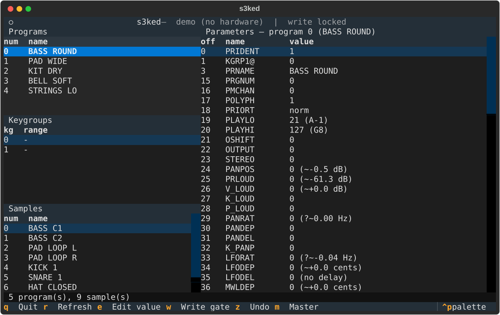
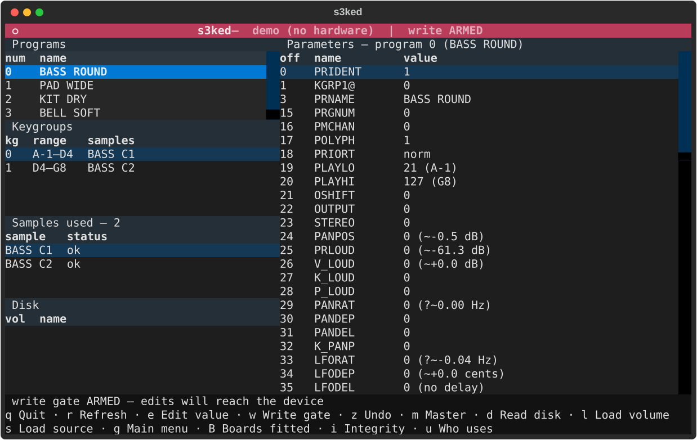
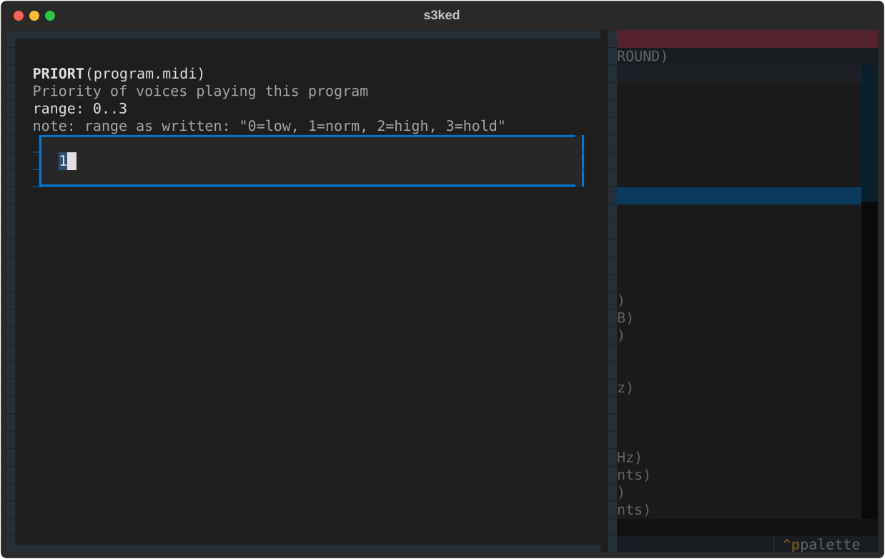
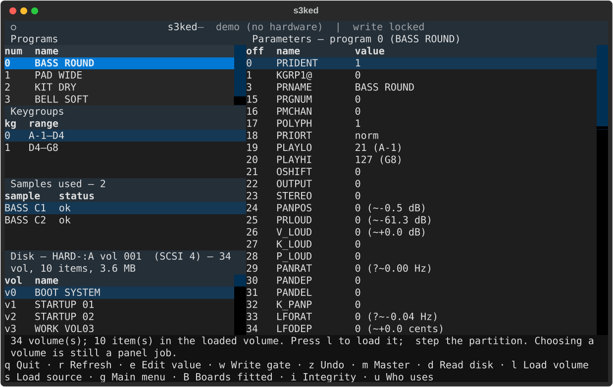
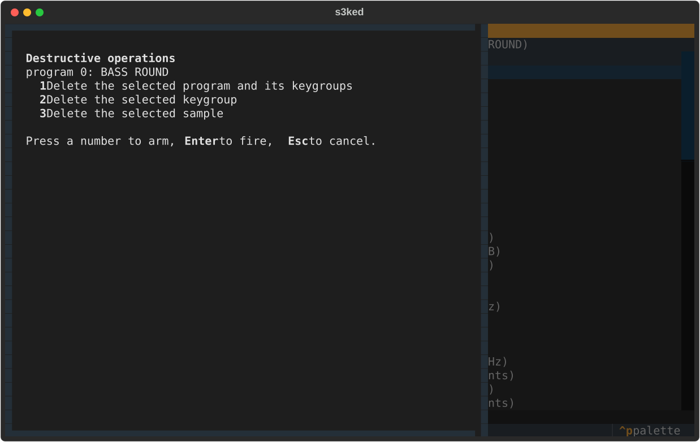

<!--
SPDX-License-Identifier: GPL-2.0-or-later
SPDX-FileCopyrightText: Copyright (C) 2026  s3ked contributors
-->

# s3ked

A terminal editor for the **Akai S1000/S3000 sampler family** — S2000,
S2800, S3000, S3000XL, S3200, S3200XL — over MIDI System Exclusive.

Browse programs, keygroups and samples; read and edit any documented header
parameter; all from a Textual TUI or a small CLI.

> ### Read this first
>
> **Nothing in this project has ever been run against real hardware.** It is
> built entirely against the published protocol documents and tested
> synthetically. The parameter byte offsets come from a third-party hand
> transcription of an Akai document, so a wrong offset writing to the wrong
> parameter is a realistic failure mode, not a theoretical one.
>
> The write gate is **off by default** for that reason. Back up anything you
> care about to disk first, and read [DISCLAIMER.md](DISCLAIMER.md).

## Is this the screen mirror you were looking for?

No — and that is settled rather than unexplored. The sibling
[k2kremote](https://github.com/lentferj/k2kremote) project mirrors a Kurzweil
K2000's LCD in a terminal and injects front-panel presses. **The Akai
S1000/S3000 family has no protocol for that**: no display read, no button
injection, no panel echo, verified against the Akai documentation itself.
See [`docs/RESOLUTION_NOTES.md` §1](docs/RESOLUTION_NOTES.md) for the survey
and its sources.

What the family *does* have is a capable editor/librarian protocol, and that
is what s3ked implements. (Akai did ship a k2kremote-style panel protocol one
generation later, on the Z4/Z8/S5000/S6000/MPC4000 — but its screen read is a
USB bulk transfer, not SysEx, so it needs a port this family lacks. §1 has the
details.)

## Install

```sh
git clone https://github.com/lentferj/s3ked
cd s3ked
python3 -m venv .venv
.venv/bin/pip install -e '.[dev]'      # quote it — zsh globs brackets
```

Requires Python 3.11+ and two packages: `textual` and `python-rtmidi`. Both
come from PyPI as wheels, so nothing needs compiling and no system packages
are required — tested from a clean checkout into an empty venv.

**No numpy.** The editor does no arithmetic that needs it. The bench tooling
in `probes/` does — FFTs and curve fits, for calibrating parameters against
real audio — and that is not part of the distribution. `pip install -e
'.[dev,bench]'` adds it if you want to run the calibration tests too; without
it those two modules skip and the rest of the suite runs.

Add `--system-site-packages` to the `venv` line only if you would rather reuse
a system `python-rtmidi` you already have.

## What it looks like



The write gate is closed until you open it, and the header says which state it
is in:



Editing one parameter shows its range and the specification's own wording for
it, so a value can be checked against the document without leaving the screen:



`d` reads the volume list off the attached SCSI disk — a ZuluSCSI, a real
drive, whatever is bolted on:



`[` and `]` step the partition, and `l` loads the selected volume — both write
to the machine, so both need the write gate. The load confirms first and says
whether the volume **fits in free memory**, which is the one thing the sampler
will not tell you until it has already half-loaded and stopped with
"insufficient waveform memory", leaving programs whose samples never arrived
playing silence.

The volume itself is the one part that stays manual: there is no volume
register to write, so choose it at the panel. `s3kcli` and the pane read
whichever one the panel last selected.

The read is 7 round trips for a 100-volume disk, about 1.3 seconds, which is
why it happens on `d` rather than at startup.

Deleting anything lives behind a separate screen that has to be armed and then
fired, because the protocol offers no device-side confirmation and no undo:



These are generated from `--demo` by `tools/screenshots.py`, which checks each
image contains what its caption claims before it is written.

## Try it without hardware

Every command takes `--demo`, which runs against an in-memory sampler and
opens no MIDI ports at all:

```sh
.venv/bin/s3kcli --demo status
.venv/bin/s3kcli --demo programs
.venv/bin/s3kcli --demo header program 0
.venv/bin/s3ked  --demo                  # the TUI
```

## Using it

```sh
s3kcli ports                             # what MIDI ports exist here
s3kcli status                            # autodetect, then RSTAT
s3kcli programs                          # resident program names
s3kcli header keygroup 2 --keygroup 0    # a whole header, decoded
s3kcli header multipart 3                # multi mode (S2000/S3000XL/S3200XL)
s3kcli get PRIORT 0                      # one parameter
s3kcli --allow-write set PRIORT 3 0      # write one parameter
s3kcli params --search LFO               # browse the table, no device needed
```

### Values in units you can read

The specification gives every parameter a range and none of its meaning:
`FILFRQ` is "basic filter frequency, 0 to 99" and not one word about which
hertz. Those laws were measured on hardware, so s3ked shows both:

```sh
$ s3kcli get TEMPER 0
TEMPER = equal temperament  (raw (0, 0, 0, 0, 0, 0, 0, 0, 0, 0, 0, 0))

$ s3kcli get FILFRQ 0
FILFRQ = 0 (?~6.46 Hz)  (raw 0)
```

and takes a quantity where a raw number would go:

```sh
$ s3kcli --allow-write set FILFRQ 500Hz 0
FILFRQ = 61 (~491 Hz)

$ s3kcli --allow-write set ATTAK1 250ms 0
ATTAK1 = 66 (~258 ms)
```

The parameter is an integer, so 500 Hz lands on the value that gives 491 --
and the read-back says so rather than echoing what was asked for.

35 laws are measured, in hertz, seconds, decibels, cents, dB/s and a few
dimensionless ratios. **A rendering carries its own doubt.** The `?` above is
not noise: `FILFRQ` 0 is below the range the law was measured over, so the
6.46 Hz is an extrapolation and says so. A law whose meaning is not yet
settled renders with `!` instead. Neither mark is decoration -- a fit is not a
specification, and the machine is free to do something else where nobody
looked.

Where a value is an enumeration from the document rather than a measurement,
the name wins over the fit. `TEMPER` is twelve independent detunes, one per
semitone, and reads as notes rather than as twelve numbers.

**Autodetect has to sweep**, because this protocol has no broadcast address:
a device answers only on its own exclusive channel, and the only message that
reports that channel can only be sent to the right channel. s3ked probes
channel 0 (the factory value) on every port; if your machine is elsewhere,
pass `--exclusive-channel N`. The port pair that answers is remembered in
`config.toml`.

### TUI keys

| key | action |
|---|---|
| `e`, `Enter` | edit the selected parameter |
| `w` | toggle the write gate (shown in the header when armed) |
| `z` | undo the last write |
| `r` | re-read the catalog |
| `d` | read the disk — volumes and the loaded volume's contents |
| `[` `]` | step the partition (writes) |
| `l` | load the selected volume (writes, confirms, checks it fits) |
| `i` | integrity — which zones name a sample that is not there |
| `u` | who uses the selected sample |
| `s` | load source — SCSI drive, floppy/hard/flash, partition |
| `g` | main menu — move the machine between its pages |
| `m` | Master — the destructive operations |
| `q` | quit |

**Destructive operations are never a single keypress.** Deleting a program,
keygroup or sample is reachable only through the Master screen, which requires
arming an action and then firing it, and then answering a confirmation. The
protocol offers no device-side confirmation and no undo for any of them.

## How it is put together

Two packages, mirroring the sibling eosed project's split:

| module | role |
|---|---|
| `s3k/messages.py` | the wire codec — framing, nibbling, opcodes, one class per message |
| `s3k/params.py` | what the bytes mean — 268 fields across five structures |
| `s3k/bridge.py` | MIDI transport, throttling, port discovery, high-level operations |
| `s3ked/app.py` | the Textual TUI (`s3ked`) |
| `s3ked/cli.py` | the CLI (`s3kcli`) |
| `s3ked/demo.py` | the demo sampler, used by `--demo` and by the tests |

Three protocol facts shape most of the design:

1. **Names are not ASCII.** A name byte indexes a 41-entry Akai character set
   (`0-9`, space, `A-Z`, `#+-.`), so `A` is 11, not 0x41.
2. **Data bytes are nibbled** — each byte travels as two, low nibble first.
3. **The device repaints its own screen** after a write, and acknowledges the
   write with `REPLY`. Both are things the sibling eosed project has to work
   around the absence of.

Five byte-addressable structures are covered: `program`, `keygroup`, `sample`,
and — on the S2000/S3000XL/S3200XL only — the `multi` file header and its 16
`multipart` entries.

## Tests

```sh
.venv/bin/python -m pytest
```

691 tests, all synthetic — no hardware, no MIDI ports, no ALSA sequencer
needed. They cannot tell you an offset is *correct*; what they do check is
that no two parameters claim the same byte, that no span runs past the end of
its structure, that `describe_value` never raises anywhere in any parameter's
range, and that no single keypress in the TUI can reach a delete.

A second group pins what the hardware taught, so a correction cannot be lost
by a later edit: every measured law against the parameter range it was fitted
inside, the failure shapes each probe had to survive (a frozen reading, a
collapsed span, the difference of two noise floors), and the README's own
example output.

One test is worth more than the rest: `test_multi_part_offsets_mirror_the_program_header`
pins the twelve offsets where two *separately transcribed* Akai documents
independently agree (RESOLUTION_NOTES §8) — the only external check on the
parameter table that exists without hardware.

## Status

See [TODO.md](TODO.md). The short version: complete as software, and the
protocol and parameter table are now **calibrated against a real S3000XL**.

The byte offsets, the write path and the physical-unit laws below have been
exercised on hardware; `docs/RESOLUTION_NOTES.md` records every measurement,
including the ones that were wrong and had to be retracted. Several were: a
filter-frequency law that read 20-30 % high because it was fitted through a
spectral centroid, a "pan LFO does nothing" verdict that turned out to be one
dead destination rather than five dead fields, and a tuning range transcribed
256x too narrow. Each retraction is left in place next to what replaced it.

What remains unverified is listed in TODO.md rather than implied here. The
largest items are the fields only a person at the front panel can confirm
(`HW_PANEL_CHECKS.md`), two modulation sources whose stimulus is not
documented anywhere, and the second filter, which needs the optional IB304F
board this machine does not have.

## License and third-party sources

GPL-2.0-or-later. Full text in [COPYING](COPYING); attributions in
[LICENSE](LICENSE).

| component | source | license |
|---|---|---|
| `s3k/messages.py`, `s3k/params.py` | Frame layout, operation codes, header offsets/ranges transcribed as data from Akai's *S1000 MIDI Exclusive Communication*, *S2800/S3000/S3200 MIDI System Exclusive Extensions* and *S2000/S3000XL/S3200XL MIDI System Exclusive Extensions*. Not redistributed. | protocol facts used as data |
| `s3k/bridge.py` | Throttled output, `MultiIn`, the ALSA-client leak fix and port enumeration ported from the sibling [eosed](https://github.com/lentferj/eosed), which ports them from [k2kremote](https://github.com/lentferj/k2kremote) and mpc2emu | GPL-2.0-or-later |
| everything else | original work | GPL-2.0-or-later |

Akai, S1000, S2000, S3000, S3000XL and related names are trademarks of their
respective owners. This project is not affiliated with, endorsed by, or
sponsored by Akai.

AI assistance in building this project is disclosed in
[DISCLAIMER.md](DISCLAIMER.md).
