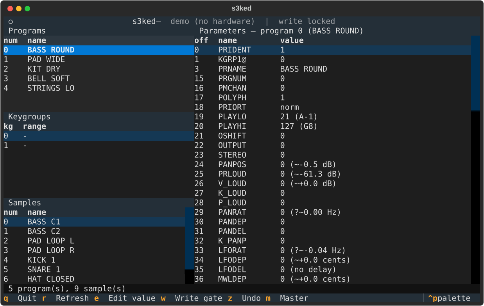
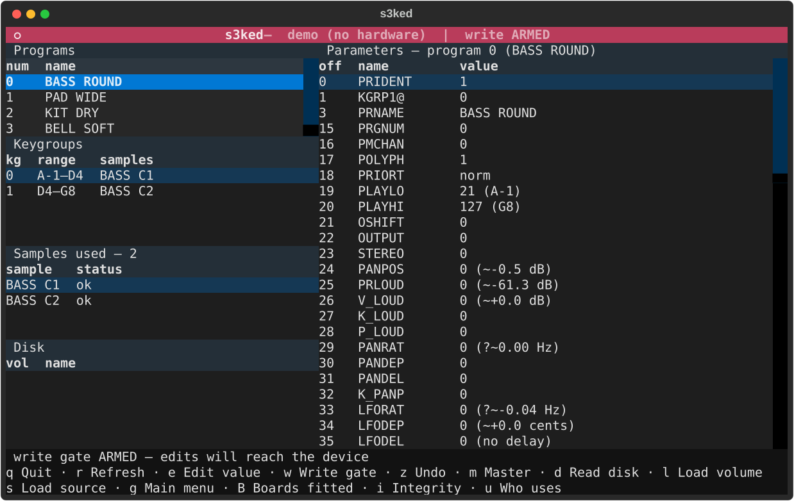
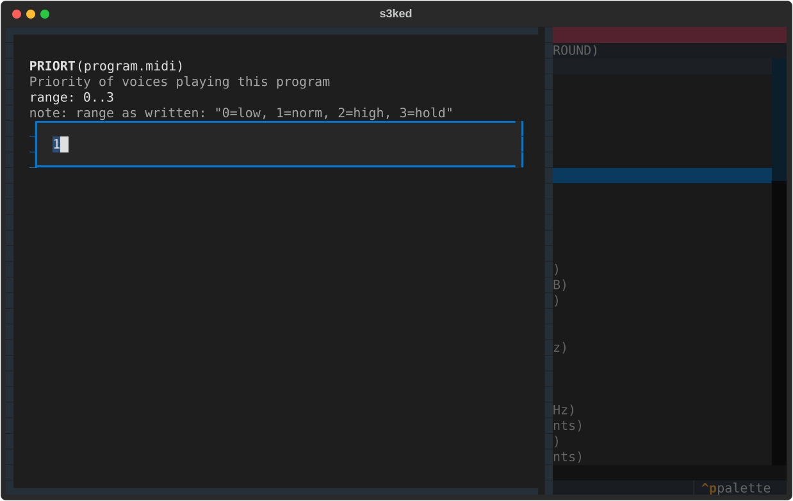
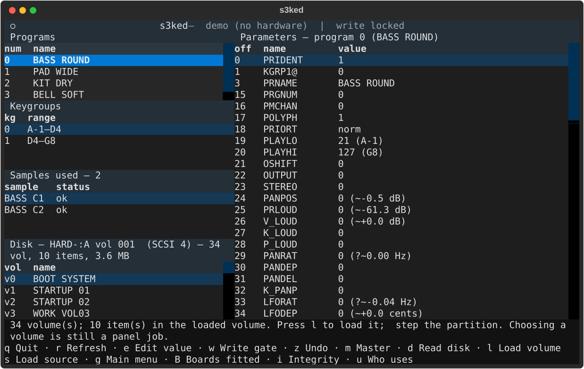
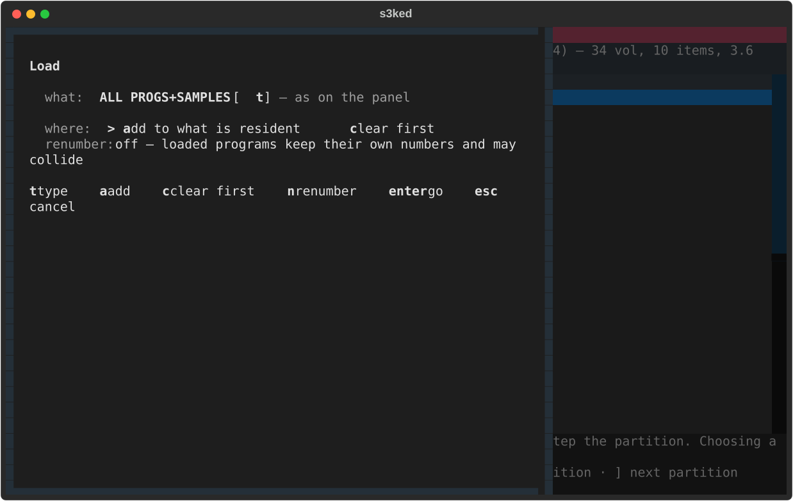
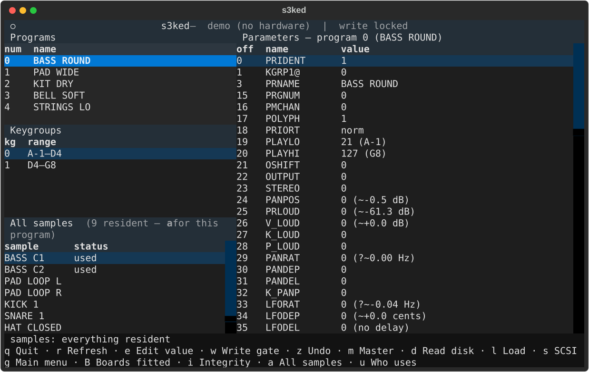
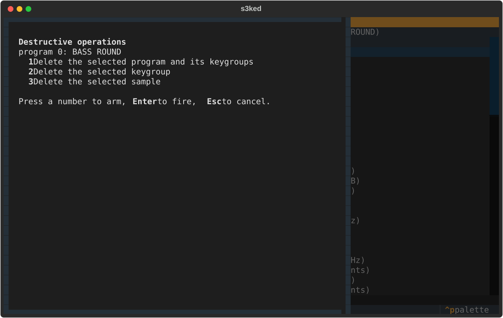
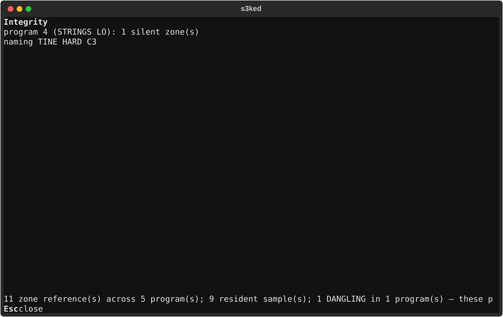

<!--
SPDX-License-Identifier: GPL-2.0-or-later
SPDX-FileCopyrightText: Copyright (C) 2026  s3ked contributors
-->

# s3ked

A terminal editor for the **Akai S1000/S3000 sampler family** — S2000,
S2800, S3000, S3000XL, S3200, S3200XL — over MIDI System Exclusive.
Driven and verified against an **S3000XL**; see
[Hardware compatibility](#hardware-compatibility) for what that means
for the other five.

Browse programs, keygroups and samples; read and edit any documented header
parameter; all from a Textual TUI or a small CLI.

## ⚠️ Use at your own risk — back up first, hardware verification is extensive but partial

s3ked is provided **as is, with absolutely no warranty and no liability** for
data loss or **hardware damage**. You assume all risk. Full terms:
[DISCLAIMER.md](DISCLAIMER.md).

**This has been driven hard against a real S3000XL.** The read paths, the
write path, the physical-unit laws and the whole disk workflow have been
exercised on hardware, along with all three deletes — program, keygroup and
sample. `docs/RESOLUTION_NOTES.md` records
each measurement — including the ones that
turned out to be wrong and were retracted. Live use is what found most of the
interesting bugs; no amount of reading the specification would have surfaced
them.

**What that verification cost, stated plainly, because it is the honest
warning:** this project has crashed an S3000XL twice by writing a register out
of range, and wedged it twice more by killing its own client mid-exchange. All
four needed a power cycle. Nothing was lost — the machine's RAM is volatile
and nothing was written to disc — but a sampler that stops answering until you
reach behind it is exactly the failure mode to expect while pointing this at
something you care about.

The parameter byte offsets come from a third-party hand transcription of an
Akai document. Most are now confirmed, and the ones that are not are listed in
[TODO.md](TODO.md) rather than implied to be safe. A wrong offset writing to
the wrong parameter remains a realistic failure mode.

The write gate is **off by default** for those reasons. Back up anything you
care about, and read [DISCLAIMER.md](DISCLAIMER.md).

## Where this came from

s3ked is **automation for a reverse-engineering loop**, not a project that set
out to be a sampler editor.

Its sibling [mpc2emu](https://github.com/lentferj/mpc2emu) converts sample
libraries for vintage hardware, and getting the *musical* parameters right —
filters, envelopes, LFOs, tuning — means checking them against a real machine.
Done by hand that is standing at a front panel, pressing buttons, saving banks
to disk and diffing them. [eosed](https://github.com/lentferj/eosed) started
as the escape from that loop for an E-mu E4XT; s3ked is the same idea pointed
at the Akai S1000/S3000 family. If the sampler can be driven over MIDI, a
probe can be **scripted, repeated and diffed** instead of hand-performed.

**It worked, and the record of what it found is the most valuable thing
here.** [`docs/RESOLUTION_NOTES.md`](docs/RESOLUTION_NOTES.md) is 103 numbered
sections of measurements against a real S3000XL — every parameter law fitted
from audio, every register identified by watching the machine while somebody
stepped a value at the panel, and the procedure each time.

Some of what it found is in no document at all: the whole `LOAD` page turns
out to be a set of miscellaneous-data registers, so drive, partition, volume,
what to load and the load itself are all writable — and the sampler's own
directory cursor is writable too, which is what makes loading a single named
sample possible.

**Ten of those sections are retractions outright, and twenty carry one**, all
left in place beside what replaced them. That is deliberate: a measurement
that was wrong and the reason it looked right are worth more than a clean list
of conclusions, and
several of this project's worst mistakes were confidently documented before
they were caught. The one that recurs is a *search procedure being read as a
fact about the world* — "we looked and found nothing" written down as "there
is nothing there".

The TUI exists because a probe you can steer interactively finds things a
fixed script does not — the same bargain eosed describes, and the same
`ed`-flavoured one: terse keys, dense panes, numbers where a prettier tool
would draw a knob.

---

## AI assistance & human authorship

s3ked was built by its human author, **Jan Lentfer**, together with
Anthropic's **Claude**. The **ideas, the project vision, and every feature**
came from the human author; Claude assisted with **writing the code** and the
docs. Crucially, the **reverse engineering rests on hands-on human work** —
every protocol behaviour this depends on was established against a real
S3000XL, and the readings that only a person at the front panel can make are
the ones the whole disk workflow turned on: the load-type list, the volume
register, the directory cursor, and the LCD confirming that a write had moved
the machine rather than merely being stored. Full account in
[DISCLAIMER.md](DISCLAIMER.md).

---

## Is this the screen mirror you were looking for?

No — and that is settled rather than unexplored. The sibling
[k2kremote](https://github.com/lentferj/k2kremote) project mirrors a Kurzweil
K2000's LCD in a terminal and injects front-panel presses, and
[eosed](https://github.com/lentferj/eosed) does the editor half for an E-mu
E4XT. **The Akai
S1000/S3000 family has no protocol for that**: no display read, no button
injection, no panel echo, verified against the Akai documentation itself.
See [`docs/RESOLUTION_NOTES.md` §1](docs/RESOLUTION_NOTES.md) for the survey
and its sources.

What the family *does* have is a capable editor/librarian protocol, and that
is what s3ked implements. (Akai did ship a k2kremote-style panel protocol one
generation later, on the Z4/Z8/S5000/S6000/MPC4000 — but its screen read is a
USB bulk transfer, not SysEx, so it needs a port this family lacks. §1 has the
details.)

## Hardware compatibility

**Verified on exactly one machine: an Akai S3000XL.** Everything below is what
the documents guarantee, not what anyone has run — no S2800, S3000, S3200,
S2000 or S3200XL has ever been on the bench.

That matters less than it sounds for header editing and more than it sounds
for the disk, because the two halves came from different places:

| layer | where it came from | on an S2800/S3000/S3200 |
|---|---|---|
| Frame, opcodes `27`–`38` | *S2800/S3000/S3200 SysEx Extensions* | **native** — it is their own document |
| the 269 header parameters | the same document | **native**; 233 carry no model qualifier at all |
| Multi mode (`41`/`42`) | *S2000/S3000XL/S3200XL* | **absent** — requests time out |
| miscellaneous registers (disk, mode, CLR) | **undocumented; found by probing an S3000XL** | **unknown** |

The parameter table is not an XL table adapted to the S3000. It **is** the
S2800/S3000/S3200 table; the XL is merely the machine it was validated against.

**s3ked cannot tell which model it is talking to.** Byte 4 is `0x48` for the
whole line — "The S3000 shares the same model as the S1000" — and `STAT`'s
version pair does not decode as documented even on the XL, where a panel
reporting OS 2.00 yields 17.00 (`docs/RESOLUTION_NOTES.md` §10). Anything
model-specific has to be a setting, not a probe.

### What is known to differ

1. **The disk and mode pages rest on reverse-engineered registers.** The
   miscellaneous data-index table appears in none of the three documents
   (§5), so drive select, partition, volume select, the load trigger, CLR and
   the program-number register were all found by probing an S3000XL. Nothing
   says the earlier generation numbers them the same — and this is most of
   what makes s3ked more than a header editor.
2. **The mode table describes the XL's front panel.** The S2000/S3000XL
   document opens by saying the modes "have been redefined", and s3ked's
   eleven pages come from that redefinition. Writing a page the machine does
   not have is not refused: on the XL, page 11 floods the LCD and needs a
   power cycle (§85).
3. **`VZOUT1`–`VZOUT4` are declared `0..10`; an S2800 accepts `0..4`.** It has
   two individual outputs rather than eight, and program `OUTPUT` differs the
   same way. Writing a register out of range is what crashed this project's
   S3000XL, twice.
4. **Keygroup offsets 161/162 read one value low.** s3ked uses the XL's
   six-value `KFXCHAN`/`KFXSLEV` enumeration; the plain S2800/S3000/S3200
   enumeration has five values and no `PRG` (§3).
5. **Multi mode does not exist there.** Nineteen of the twenty-one XL-only
   parameters are the `multi` and `multipart` regions, and those requests
   simply go unanswered.

An **S3200** gains rather than loses: its second LSI is fitted as standard, so
the fifteen fields s3ked gates behind the `ib304f_fitted` declaration are real
hardware on that machine.

### If you have one of these

Reads should work and carry little risk — that half is defined by the
machine's own document. Header writes should be correct for the same reason.
**Stay off the LOAD/SAVE and mode pages** until someone confirms the
miscellaneous register numbers on that generation: that is the
reverse-engineered part, and its failure mode so far has been a reboot rather
than an error message.

Reports welcome, negative ones most of all.

## Install

```sh
git clone https://github.com/lentferj/s3ked
cd s3ked
python3 -m venv .venv
# vinsynlib first — see below. --no-deps because its deps are ours too.
.venv/bin/pip install --no-deps -e ../vinsynlib
.venv/bin/pip install -e '.[dev]'      # quote it — zsh globs brackets
```

Requires Python 3.11+, `textual`, `python-rtmidi`, and **`vinsynlib`** — the
shared base of this family of terminal instrument browsers, which holds the
settings cache, the keymap and legend, the command line and the port listing.
`textual` and `python-rtmidi` come from PyPI as wheels, so nothing needs
compiling and no system packages are required.

**vinsynlib is not on PyPI.** It is a sibling checkout, so it is installed
from the working tree and installed *first*, so the second command finds the
requirement already satisfied. `uv` reads the path from `[tool.uv.sources]`
in `pyproject.toml` instead of being told. The checkout therefore has to look
like this:

```
git-repos/
  s3ked/           <- this one
  vinsynlib/       <- the shared base
  emorphed/  ensqsqed/  eosed/  rxved/  ...
```

`pip install -e '.[dev]'` on its own fails on a machine set up from an older
copy of this text, with `No matching distribution found for vinsynlib`.

**No numpy.** The editor does no arithmetic that needs it. The bench tooling
in `probes/` does — FFTs and curve fits, for calibrating parameters against
real audio — and that is not part of the distribution. `pip install -e
'.[dev,bench]'` adds it if you want to run the calibration tests too; without
it those two modules skip and the rest of the suite runs.

Add `--system-site-packages` to the `venv` line only if you would rather reuse
a system `python-rtmidi` you already have.

## What it looks like



The write gate is closed until you open it, and the header says which state it
is in:



Editing one parameter shows its range and the specification's own wording for
it, so a value can be checked against the document without leaving the screen:



### The disk, driven entirely from the terminal

This is the part worth having. **The whole of the sampler's LOAD page is
reachable over MIDI** — SCSI drive, device, partition, volume, what to load
and the load itself — so a disc can be browsed and pulled into memory without
touching the machine.



`d` or `l` opens the browser in the right-hand pane, showing the volumes on
the current partition and, below a divider, the contents of the selected one.
`[` and `]` step the partition; `Enter` on a volume selects it.

`l` from inside the browser offers the load, and there is more to choose than
there sounds:




| | |
|---|---|
| **all eight load types** | `ENTIRE VOLUME`, `ALL PROGS+SAMPLES`, `programs only`, `all samples`, the two cursor variants, `Multi+progs+Samps` — `t` cycles them |
| **one item at a time** | put the cursor on a program or sample row and the load aims at exactly that, by writing the machine's own directory highlight |
| **onto what is there, or onto an emptied machine** | a load *adds* to what is resident rather than replacing it, so building a bank from several volumes needs the *sum* to fit |
| **renumber afterwards** | because each volume's programs keep the numbers they were saved with, and a second volume's arrive interleaved with the first's |

The load confirms first and says whether it **fits in free memory** — the one
thing the sampler will not tell you until it has already half-loaded and
stopped with "insufficient waveform memory", leaving programs whose samples
never arrived playing silence.

Everything here writes to the machine, so all of it needs the write gate.

> **Why the renumbering matters.** `PRGNUM` — the MIDI program number — is
> stored *inside* each program and reloaded verbatim, and volumes authored
> independently all start at 1. Load four of them and four programs claim
> number 1; they do not overwrite each other, they **stack**, so one program
> change fires all four at once. The panel's `RNUM` → `SEQU` fixes it and so
> does this, in one keystroke.
>
> A load does **not** append. The machine inserts arrivals in program-number
> order, so two volumes both numbering from 1 comb together and a program's
> position in the list stops telling you which volume it came from. s3ked
> therefore snapshots what is resident *before* the load and identifies the
> arrivals afterwards, giving the new volume a contiguous range of its own
> rather than every other number.

The volume list is 7 round trips for a 100-volume disk, about 1.3 seconds,
which is why it happens on `d` rather than at startup.

`Operating System` is the one load type the TUI will not offer: it loads an OS
off the disc over the running one, and the bridge refuses it without an
explicit flag.

#### Saving, and the paragraph that used to sit here

> ⚠️ **Experimental.** Newer than the rest of this project and much less
> exercised. The registers behind it are measured on hardware
> (`RESOLUTION_NOTES` §127); the screen that drives them has been run against
> the demo and **not yet against real media**. It is the only operation here
> that writes to a disc rather than to RAM, so it is the only one a reload
> does not undo. The screen says so itself.

`S` saves what is in memory to the disc — behind the write gate, then a
screen mirroring the Load one, then a confirmation naming what it will write
and over what.

**This section used to say saving was impossible, and it was wrong.** It is
left described rather than quietly replaced, because how it was wrong is
worth more than the feature.

The claim was that the protocol defines no save: the disk surface is *list
the volumes* and *read a directory*, with no write-file and no create-volume,
and the load works only because the LOAD *page* carries a register that fires
when written. All of that is still true. The error was concluding that the
SAVE page therefore had nothing equivalent.

It does. `byte[8]` creates a volume from what is resident and `byte[9]`
overwrites the selected one — two registers, not one with a flag. A first
sweep missed them and recorded a **false negative** (`RESOLUTION_NOTES` §122)
by making three mistakes at once: it tested `byte[6]`, which is the *load*
trigger; it watched the volume directory, which a load changes anyway; and it
aimed at an empty slot. The positive control it ran validated the wire, not
the detector. §127 is the retraction.

The other half — *"a save needs a destination volume name, and no register in
the miscellaneous bank carries a name"* — was wrong the same way. The
selector table listing a **name bank** had been in these notes since §5; only
the byte and word banks were ever swept. Index 6 of that bank renames the
selected volume.

So the machine names a new volume `VOLUME nnn` itself, and naming it
otherwise is a **second operation** rather than an argument to the save. The
TUI offers it and says so, because a rewrite resets the name even when the
save is a subset of what was there.

The samples pane shows what the selected program references; `a` swaps it for
everything the machine holds, which is the view the integrity work is done
from:



Deleting anything lives behind a separate screen that has to be armed and then
fired, because the protocol offers no device-side confirmation and no undo:



### Expansion boards must be declared

Fifteen keygroup fields belong to the optional **IB304F** filter board — the
second filter, the tone section, and all eight stages of envelope 3 — and the
effects pages belong to the **EB16**. On a machine without them these are not
merely inert: the panel refuses to open the pages at all, and this project
crashed an S3000XL twice in one session while that area was being exercised
(`docs/RESOLUTION_NOTES.md` §85, §90).

So s3ked refuses to read or write them unless you say the board is there:

```toml
# config.toml
ib304f_fitted = true
eb16_fitted   = false
```

or press `B` in the TUI. **The machine cannot be asked** — no reply carries a
fitted-options field, and the mode register will happily open a page the
panel refuses — so this is a declaration, and the default assumes nothing is
fitted.

### What plays silence

A load that overruns memory says "insufficient waveform memory" **once** and
then behaves normally. The programs stay resident and selectable; the ones
whose samples never arrived play nothing, and the machine will not tell you
which. `i` walks every keygroup and says:



`u` answers the other direction — every zone that uses the selected sample.
Both are read-only, so neither needs the write gate. From the shell:

```console
$ s3kcli audit
DANGLING -- these zones name a sample the machine does not hold, and play silence:

prog  program      kg  zone  names
4     STRINGS LO   2   1     TINE HARD C3

11 zone reference(s) across 5 program(s); 9 resident sample(s); 1 DANGLING in 1 program(s) — these play silence; 3 unused sample(s)

$ s3kcli audit --sample "BASS C2"
prog  program      kg  zone
0     BASS ROUND   1   1
1     BASS SUB     0   1

2 zone(s) use 'BASS C2'
```

Zones reference samples by **name**, not by number, so renaming a sample
breaks every zone that named it — and because the machine enforces no name
uniqueness, two samples sharing a name make a reference that cannot be
resolved to either. The audit reports that rather than picking one.

These are generated from `--demo` by `tools/screenshots.py`, which checks each
image contains what its caption claims before it is written.

## Try it without hardware

Every command takes `--demo`, which runs against an in-memory sampler and
opens no MIDI ports at all:

```sh
.venv/bin/s3kcli --demo status
.venv/bin/s3kcli --demo programs
.venv/bin/s3kcli --demo header program 0
.venv/bin/s3ked  --demo                  # the TUI
```

## Using it

```sh
s3kcli ports                             # what MIDI ports exist here
s3kcli status                            # autodetect, then RSTAT
s3kcli programs                          # resident program names
s3kcli header keygroup 2 --keygroup 0    # a whole header, decoded
s3kcli header multipart 3                # multi mode (S2000/S3000XL/S3200XL)
s3kcli get PRIORT 0                      # one parameter
s3kcli --allow-write set PRIORT 3 0      # write one parameter
s3kcli params --search LFO               # browse the table, no device needed
```

### Values in units you can read

The specification gives every parameter a range and none of its meaning:
`FILFRQ` is "basic filter frequency, 0 to 99" and not one word about which
hertz. Those laws were measured on hardware, so s3ked shows both:

```sh
$ s3kcli get TEMPER 0
TEMPER = equal temperament  (raw (0, 0, 0, 0, 0, 0, 0, 0, 0, 0, 0, 0))

$ s3kcli get FILFRQ 0
FILFRQ = 0 (?~6.46 Hz)  (raw 0)
```

and takes a quantity where a raw number would go:

```sh
$ s3kcli --allow-write set FILFRQ 500Hz 0
FILFRQ = 61 (~491 Hz)

$ s3kcli --allow-write set ATTAK1 250ms 0
ATTAK1 = 66 (~258 ms)
```

The parameter is an integer, so 500 Hz lands on the value that gives 491 --
and the read-back says so rather than echoing what was asked for.

35 laws are measured, in hertz, seconds, decibels, cents, dB/s and a few
dimensionless ratios. **A rendering carries its own doubt.** The `?` above is
not noise: `FILFRQ` 0 is below the range the law was measured over, so the
6.46 Hz is an extrapolation and says so. A law whose meaning is not yet
settled renders with `!` instead. Neither mark is decoration -- a fit is not a
specification, and the machine is free to do something else where nobody
looked.

Where a value is an enumeration from the document rather than a measurement,
the name wins over the fit. `TEMPER` is twelve independent detunes, one per
semitone, and reads as notes rather than as twelve numbers.

**Autodetect has to sweep**, because this protocol has no broadcast address:
a device answers only on its own exclusive channel, and the only message that
reports that channel can only be sent to the right channel. s3ked probes
channel 0 (the factory value) on every port; if your machine is elsewhere,
pass `--exclusive-channel N`. The port pair that answers is remembered in
`config.toml`.

### TUI keys

| key | action |
|---|---|
| `e`, `Enter` | edit the selected parameter |
| `w` | toggle the write gate (shown in the header when armed) |
| `+` `-` | step the selected parameter by one (hold to repeat) |
| `z` | undo the last write |
| `Z` | undo everything written this session |
| `h` | change history — every write, with where it went |
| `r` | re-read the catalog |
| `d` | read the disk and show the browser |
| `l` | open the browser; from inside it, offer the load |
| `t` | *(in the load screen)* cycle the eight load types |
| `[` `]` | step the partition (writes) |
| `Enter` | *(disk pane)* select that volume · *(programs pane)* make that the active program |
| `a` | samples pane: this program's, or everything resident |
| `i` | integrity — which zones name a sample that is not there |
| `u` | who uses the selected sample |
| `s` | SCSI — drive, floppy/hard/flash, partition |
| `g` | main menu — move the machine between its pages |
| `B` | declare which expansion boards are fitted (see below) |
| `m` | Master — the destructive operations |
| `Esc` | leave the disk browser, or close a dialog |
| `q` | quit |

### Editing, and putting it back

Editing is `e` (or `Enter`) on a parameter row, type the value, `Enter`. The
editor shows the field's range and the specification's own wording for it, so
a value can be checked against the document without leaving the screen.

`+` and `-` step a numeric parameter by one, and the terminal's own key
repeat means holding one works. A run of them **collapses into a single undo
entry** keeping the value the run started from, so ten taps are one thing to
undo rather than ten. Nudging skips the catalog re-read an ordinary edit
does — it cannot rename anything, so nothing can have gone stale, and two
list requests per keypress would make it unusable.

Every write is logged with the value it replaced and **where it went** —
region, item index and keygroup. That last part matters: the same parameter
name at two different keygroups is two genuinely different fields.

- **`z`** steps back one change at a time.
- **`Z`** undoes everything written this session, newest first — two edits to
  one field have to land in reverse order or the older value wins.
- **`h`** opens the log as a `# | where | parameter | old | new` table.

An undo is a write like any other, so all of it is gated behind the write
gate. A pending count shows in the header rather than the status line, which
any catalog re-read would otherwise scroll away. If a write fails part-way
through `Z`, the remaining log is **kept** rather than discarded, so it can be
retried.

The log is in-memory and lasts the session. That is not much of a limitation:
a remote edit only lives in the sampler's RAM until it is
[saved to disc](#saving-and-the-paragraph-that-used-to-sit-here), so reloading
or power-cycling is the real undo-everything.

This follows the sibling [eosed](https://github.com/lentferj/eosed), which
had `z`/`Z`/`h` first; s3ked had only `z` until 2026-08-15.

**Dialogs stay open until you leave them.** The SCSI screen, the main-menu
screen and the load screen all apply each keypress immediately and wait for
`Esc`, rather than closing on the first key that matches. Picking the wrong
one should cost a keypress, not a re-open.

**Destructive operations are never a single keypress.** Deleting a program,
keygroup or sample is reachable only through the Master screen, which requires
arming an action and then firing it, and then answering a confirmation. The
protocol offers no device-side confirmation and no undo for any of them.

## How it is put together

Two packages, mirroring the sibling eosed project's split:

| module | role |
|---|---|
| `s3k/messages.py` | the wire codec — framing, nibbling, opcodes, one class per message |
| `s3k/params.py` | what the bytes mean — 268 fields across five structures |
| `s3k/bridge.py` | MIDI transport, throttling, port discovery, high-level operations |
| `s3ked/app.py` | the Textual TUI (`s3ked`) |
| `s3ked/cli.py` | the CLI (`s3kcli`) |
| `s3ked/demo.py` | the demo sampler, used by `--demo` and by the tests |

Three protocol facts shape most of the design:

1. **Names are not ASCII.** A name byte indexes a 41-entry Akai character set
   (`0-9`, space, `A-Z`, `#+-.`), so `A` is 11, not 0x41.
2. **Data bytes are nibbled** — each byte travels as two, low nibble first.
3. **The device repaints its own screen** after a write, and acknowledges the
   write with `REPLY`. Both are things the sibling eosed project has to work
   around the absence of.

Five byte-addressable structures are covered: `program`, `keygroup`, `sample`,
and — on the S2000/S3000XL/S3200XL only — the `multi` file header and its 16
`multipart` entries.

## Tests

```sh
.venv/bin/python -m pytest                                       # 1019 tests, ~8m30
.venv/bin/python -m pytest -m "not slow and not tui"            # 837 tests, ~71s
.venv/bin/python -m pytest -m "not slow and not tui and not bench"  # 599 tests, ~8s
```

1019 tests, all synthetic — no hardware, no MIDI ports, no ALSA sequencer
needed. **Every line above is measured on the machine described below, not
estimated.**

**If you are reviewing this project and want a bounded run, use the second or
third line.** `-m "not slow and not tui"` drops the Textual event loop;
`-m "not slow and not tui and not bench"` also drops the probe-side analysis
suites, leaving everything the project actually installs. `tests/test_app.py`
drives the TUI and is **~436 s of the ~508 s
suite — 86 % of the runtime for 18 % of the tests**; everything else together
is a minute, and dropping the four bench files
(`test_measure.py`, `test_calibrate.py`, `test_throttle.py`, `test_jcap.py`)
as well leaves
599 tests in **~8 s**. Nothing in any of those touches hardware — the split
is Textual's event loop, not MIDI.

Every `-m` recipe repeats `not slow` on purpose: a command-line `-m`
*replaces* the `-m 'not slow'` in `pyproject.toml` rather than combining with
it, so a recipe without it silently admits the ~1m50 exhaustive Multi test
into a run that claims to be bounded. CI runs the default selection
(everything except slow); the slow test is a pre-release gate, run by hand
before tagging.

That was undocumented until 2026-09-23, when an outside reviewer allowed 240 s
for the default line, got killed 40 % through twice, and reported the suite as
unrunnable. The suite was fine and the instruction was not: *unfindable is not
the same as broken, and only the reader can tell them apart.*

**A second reviewer reported the same thing on 2026-09-25, with the paragraph
above already written and pushed.** They were looking for `-m`, which is how
every other project on this bench is bounded, found no marker, and guessed at
a file list instead — arriving at a green number that was their selection
rather than this project's. Prose that answers the question is not the same as
answering it in the form the reader will look for. The markers exist from
2026-09-25 for that reason, and `test_conformance.py` pins them so the recipes
here cannot drift out of the README. They cannot tell you an offset is *correct*; what they do check is
that no two parameters claim the same byte, that no span runs past the end of
its structure, that `describe_value` never raises anywhere in any parameter's
range, and that no single keypress in the TUI can reach a delete.

A second group pins what the hardware taught, so a correction cannot be lost
by a later edit: every measured law against the parameter range it was fitted
inside, the failure shapes each probe had to survive (a frozen reading, a
collapsed span, the difference of two noise floors), and the README's own
example output.

### What the synthetic suite cannot do, and the probes that can

A fake sampler accepts whatever it is given, so a write aimed at the wrong
place looks identical to a correct one. That is not hypothetical: the undo
path passed every synthetic test while writing to the wrong keygroup, logging
its own undos so `z` twice *redid*, and having its pane context reset out from
under it.

`probes/` holds the tools that answer what a fake cannot, by driving the real
application over a real machine and **reading every value back off the
sampler**:

```sh
.venv/bin/python probes/undo_roundtrip.py    # read -> write -> read back -> z -> read back
```

Run that after touching the edit or undo path. It is the check that found the
three bugs above, and the one that would catch them coming back.

One test is worth more than the rest: `test_multi_part_offsets_mirror_the_program_header`
pins the twelve offsets where two *separately transcribed* Akai documents
independently agree (RESOLUTION_NOTES §8) — the only external check on the
parameter table that exists without hardware.

## Development checks

Static analysis alongside the suite: ruff (lint + format), mypy, pytest-cov,
pip-audit, vulture, deptry, detect-secrets, wired through pre-commit. One
command is the gate:

```sh
make setup    # once: pip install -e ".[dev,checks]" into .venv
make check    # lint, typecheck, audit, test -- fails on any error
```

`make setup` assumes vinsynlib is already in the venv, from the Install
section above; `pip install -e ".[dev,checks]"` will not fetch it.

`make check` runs pip-audit over the dependencies this project *declares*,
read out of `pyproject.toml`, with `vinsynlib` filtered out of that list: it
is a sibling checkout rather than a package on an index, so pip cannot
resolve it and pip-audit would fail *resolving* — reporting nothing about
anything. Everything else it declares is still audited, and a new dependency
added later is audited without anyone editing the Makefile.

The individual targets are `lint`, `format`, `typecheck`, `test`, `audit`.
Configuration lives in `pyproject.toml`; the scope and the arguments that
tools cannot read from it are in the `Makefile`.

The tools are in a `checks` extra, not `dev`, and every one is pinned exactly
(`==`). `dev` stays small because CI installs it on seven platform/Python
combinations where a lint pipeline adds minutes and no signal. A lint result
that moves because a dependency moved is a result nobody can reason about.

`pre-commit` is installed and runs ruff (check + format), mypy and
detect-secrets. shellcheck and shfmt are installed system-wide but **not** wired
as hooks: this repository has no shell scripts.

### What each check will and will not catch

The point of this pipeline is that it passes on the code as it stands **and**
fails on anything new. That required baselining the existing findings, and a
baseline that grows quietly is not a baseline — so every suppression below
carries the count of what it hides and the reason it is hidden.

| Check | Pre-existing findings suppressed | How |
| --- | --- | --- |
| ruff | 1855 | per-rule `ignore` in `pyproject.toml`, each entry with its count and reason; plus `per-file-ignores` for `tests/` and `probes/` |
| mypy | 59 | `[[tool.mypy.overrides]]`, per module **and** per error code |
| vulture | 2 | `tools/vulture_whitelist.py` |
| deptry | 12 (10 by construction, 2 `jack`) | `optional_dependencies_dev_groups`, and one CLI suppression |
| detect-secrets | 0 | the tree is clean; `.secrets.baseline` records that |
| pip-audit | 0 | the project's 10 declared dependencies have no known advisories |
| `ruff format` | not enforced | see below |

**ruff.** The largest suppression is `PLC0415` (532 findings): the probes and
the CLI import lazily, inside `main()`, so that importing a module never opens
a MIDI port, never needs numpy and never pulls in the editor. That laziness is
load-bearing — it is why `s3ked --demo` runs with no MIDI stack present — so
"move it to the top" is 532 ways to break the thing the rule wants. The second
is `UP006`/`UP007`/`UP035`/`UP045` (427): `typing.Dict` and `Optional[X]` where
3.11 spells them `dict` and `X | None`. Those are genuinely stale and worth
fixing, as a commit of their own. `PLR2004` (28) is every one an inline
protocol constant — `0xF0`, `0x7F`, `0x3FFF` — kept next to the arithmetic
that uses them so the codec can be checked against the Akai document line by
line. `I001` (137) and `UP031` (122) are mechanical and `--fix` does them in
one command whenever that is wanted separately.

**The formatter is configured but not enforced on existing files**, and the
measurement behind that is worth having: it would rewrite 57 of the 59 tracked
files, 5561 lines added and 4115 removed, and at `line-length = 100` it emits a
1170-character line — a string or comment it cannot wrap — out of a file whose
longest line is *already* 1419. It also de-indents the continuation lines of
the 3400-line `_p(...)` table in `s3k/params.py`, which changes the shape of
the transcription this project exists to keep checkable. Two files
(`s3k/__init__.py`, `s3ked/__init__.py`) already comply, which is the evidence
this is a style difference and not an unreachable bar.

So `ruff format` applies to the files a commit touches (via pre-commit, and via
`make format` over `FORMAT_SCOPE`), and `make lint` does not check it. That is
the one deliberate deviation from "check runs everything": the formatter cannot
be enforced against a tree that has never been formatted. `make format-check`
reports it, and CI runs that step with `continue-on-error`.

**`jack` is suppressed, and it is not a packaging gap.** deptry's `DEP003`
fires on `jack`, imported by `probes/jcap.py` and `probes/calibrate.py` and
declared in no extra. Checked rather than assumed, it touches nothing an end
user has:

- Nothing shipped imports it. `git grep jack -- s3k s3ked` is empty, and the
  wheel is `packages = ["s3k", "s3ked"]` — `probes/` is not in it.
- The test suite does not need it either. `tests/test_jcap.py` installs a
  **fake `jack` module before importing the probe** — that is how it provokes
  the leaked-client failure paths without a server — and
  `pytest.importorskip("numpy")` so the file skips cleanly without numpy. No
  CI job and no `make test` run can be broken by jack's absence.
- It is a rig-local capture backend, not a library dependency. Both call sites
  are bench probes talking to a live JACK server, and `probes/calibrate.py`
  documents falling back to `jack_rec` when the binding is unavailable.

So it is deliberately undeclared, and in particular must **not** go into
`[project] dependencies` — that would put a build-heavy audio binding into
every end-user install to serve two scripts that are not shipped. Adding it to
the `bench` extra is defensible for symmetry with numpy and is left as a
maintainer choice; it would also make `bench` require libjack headers to
build, which the FFT-only probes do not.

**mypy is non-strict, and the reason is worth stating.** The application code
carries no annotations at all, and `s3k/bridge.py` is 3000 lines of protocol
arithmetic where an unchecked `int`/`bytes` mix-up is exactly the class of bug
that has cost this project days. Retrofitting annotations is a separate piece
of work from standing up the check, and doing both at once makes the first
review unreadable. So mypy checks what is annotated and does not require
annotations. All 59 baseline findings come from that: 36 of them are in
`s3ked/app.py` and share one root cause, which is that an unannotated Textual
app makes every `self.` an `Any`. Annotating `app.py` is how most of this
number goes to zero.

The overrides are per code *and* per module, so a new error of a kind that
already exists in that file is still reported — verified, not assumed.

Note that the per-module `[tool.mypy-some.module]` table form does **not** work
in mypy 1.18.2: it is read without complaint and then ignores its
`disable_error_code`. The baseline uses `[[tool.mypy.overrides]]`, which does.
A silently-ignored baseline is worse than no baseline, because it looks like
coverage.

### One known-flaky test

`tests/test_app.py::test_an_empty_partition_clears_the_volume_count_too` failed
once on 2026-10-02 while `make check` was being stood up, and passed on every
other run including the two after. It is not a new failure and it is not
fixed — it is recorded here because it will happen again.

The cause is the wait, not the assertion. The suite bounds its async waits by
ITERATION COUNT rather than by duration: 221 `for _ in range(N): await
pilot.pause()` loops in `test_app.py` alone, and not one `asyncio.wait_for` in
the whole tree. Counting event-loop turns is fine until something else makes
each turn slower, and `--cov` does exactly that: coverage tracing made this
suite 9m02 against 7m02 for the same 1018 tests, and on the one run that
crossed the line the test's 60-turn budget expired one turn early.

Nothing about the code under test changed. The honest fix is to bound those
waits by time, which is 221 call sites and its own piece of work — so it is
written down rather than half-done.

### Tooling that does not read its config

Three of these tools accept a configuration block and ignore it. Each was
verified by experiment, not assumed, and each is why the setting is passed on
the command line instead:

- **vulture** — `[tool.vulture]` is not a section it knows; it warns and moves on.
- **deptry** — `per_rule_ignores` in `pyproject.toml` is not read (0.25.1).
- **detect-secrets** — `[tool.detect_secrets]` is documented but not read
  (1.5.0): the generated baseline carried the tool's default plugin set.

## Status

See [TODO.md](TODO.md). The short version: complete as software, and the
protocol and parameter table are now **calibrated against a real S3000XL**.

The byte offsets, the write path and the physical-unit laws below have been
exercised on hardware; `docs/RESOLUTION_NOTES.md` records every measurement,
including the ones that were wrong and had to be retracted. Several were: a
filter-frequency law that read 20-30 % high because it was fitted through a
spectral centroid, a "pan LFO does nothing" verdict that turned out to be one
dead destination rather than five dead fields, and a tuning range transcribed
256x too narrow. Each retraction is left in place next to what replaced it.

What remains unverified is listed in TODO.md rather than implied here. The
largest items are the fields only a person at the front panel can confirm
(`HW_PANEL_CHECKS.md`), two modulation sources whose stimulus is not
documented anywhere, and the second filter, which needs the optional IB304F
board this machine does not have.

**Saving to disc used to head that list, on the grounds that the protocol had
no save at all.** It does have one, the reasons that paragraph gave were
wrong in both halves, and
[what it said and why it was wrong](#saving-and-the-paragraph-that-used-to-sit-here)
is kept above rather than deleted.

## License and third-party sources

GPL-2.0-or-later. Full text in [COPYING](COPYING); attributions in
[LICENSE](LICENSE).

| component | source | license |
|---|---|---|
| `s3k/messages.py`, `s3k/params.py` | Frame layout, operation codes, header offsets/ranges transcribed as data from Akai's *S1000 MIDI Exclusive Communication*, *S2800/S3000/S3200 MIDI System Exclusive Extensions* and *S2000/S3000XL/S3200XL MIDI System Exclusive Extensions*. Not redistributed. | protocol facts used as data |
| `s3k/bridge.py` | Throttled output, `MultiIn` and the ALSA-client leak fix ported from the sibling [eosed](https://github.com/lentferj/eosed), which ports them from [k2kremote](https://github.com/lentferj/k2kremote) and [mpc2emu](https://github.com/lentferj/mpc2emu) | GPL-2.0-or-later |
| `s3k/config.py`, the key legend, the parsers, the port listing | **vinsynlib**, this family's shared base — assembled from the copies emorphed, ensqsqed, eosed, kwsed, nanosyned, p2ked, rxved and x5ded each carried, plus the defect fixes three of those copies had drifted into. `s3k/config.py` and the settings store it wraps were this file's own before that. | GPL-2.0-or-later |
| everything else | original work | GPL-2.0-or-later |

Akai, S1000, S2000, S3000, S3000XL and related names are trademarks of their
respective owners. This project is not affiliated with, endorsed by, or
sponsored by Akai.

AI assistance in building this project is disclosed in
[DISCLAIMER.md](DISCLAIMER.md).
